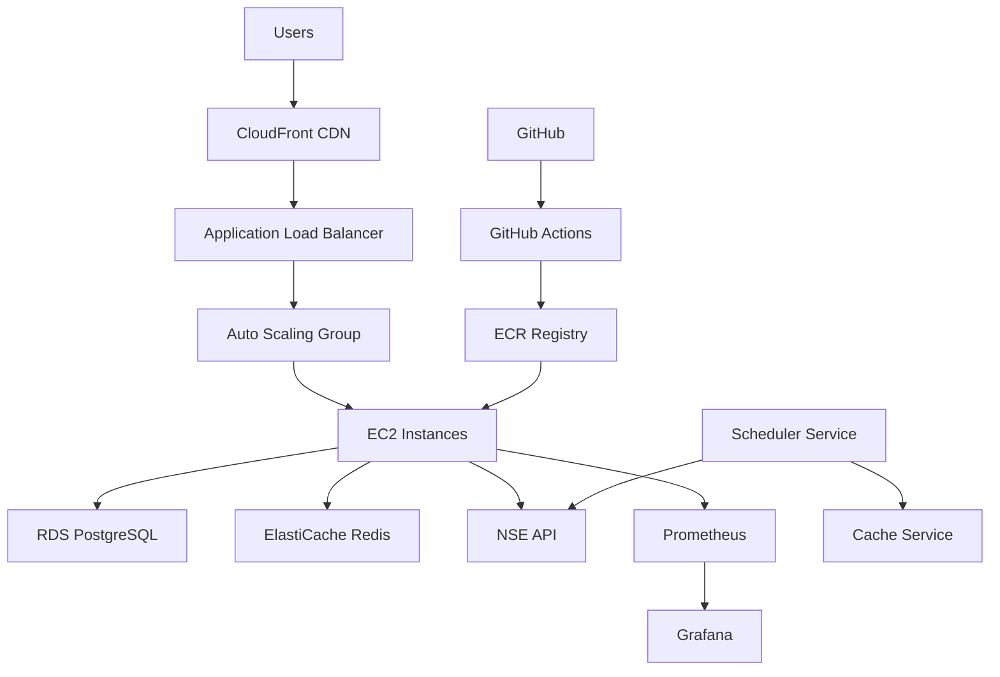

# 📈 Stock Trading Analysis Platform with Live NSE Data

[](https://github.com/omkar21-dev/stock-analysis-platform/actions)
[](https://opensource.org/licenses/MIT)
[](https://www.docker.com/)
[](https://aws.amazon.com/)
[](https://www.nseindia.com/)

> A comprehensive full-stack web application for stock trading technical analysis with **live NSE data integration** and enterprise-grade DevOps implementation

## 🌟 Project Highlights

This project demonstrates **production-ready DevOps practices** and modern software development methodologies, perfect for showcasing technical expertise in:

- ☁️ **Cloud Architecture** (AWS)
- 🐳 **Containerization** (Docker)
- 🚀 **CI/CD Automation** (GitHub Actions)
- 🏗️ **Infrastructure as Code** (Terraform)
- 📊 **Monitoring & Observability** (Prometheus, Grafana)
- 🔒 **Security Best Practices**
- 📈 **Live Market Data** (NSE Integration)

## 🚀 New Feature: Live NSE Data Integration

### Real-time Market Data
- **Live Stock Quotes**: Real-time prices from NSE
- **Market Status**: Live market open/close status
- **Top Gainers/Losers**: Dynamic market movers
- **NIFTY 50 Data**: Complete index information
- **Stock Search**: Real-time symbol and company search
- **Historical Data**: Price history and trends

### Performance Features
- **Smart Caching**: In-memory caching with configurable TTL
- **Background Updates**: Automated data refresh via cron jobs
- **Rate Limiting**: Intelligent API call management
- **Error Recovery**: Automatic retry mechanisms

### Supported Stocks
Popular Indian stocks including RELIANCE, TCS, HDFCBANK, INFY, HINDUNILVR, ICICIBANK, KOTAKBANK, BHARTIARTL, ITC, SBIN, and many more.

📖 **[Complete NSE Integration Documentation](./NSE_INTEGRATION.md)**

## 🏗️ Architecture Overview



## 🛠️ Technology Stack

### Frontend
- **React.js 18** - Modern UI library
- **Material-UI** - Component library
- **React Router** - Client-side routing
- **Axios** - HTTP client
- **Recharts** - Data visualization

### Backend
- **Node.js** - Runtime environment
- **Express.js** - Web framework
- **PostgreSQL** - Primary database
- **Redis** - Caching layer
- **JWT** - Authentication
- **Helmet** - Security middleware

### DevOps & Infrastructure
- **AWS Services**: EC2, RDS, ALB, S3, ECR, CloudWatch
- **Docker** - Containerization
- **Terraform** - Infrastructure as Code
- **GitHub Actions** - CI/CD Pipeline
- **Nginx** - Reverse proxy
- **Prometheus & Grafana** - Monitoring
- **ELK Stack** - Logging

## 🚀 Features

### Core Application
- 👤 **User Authentication** - Secure JWT-based auth
- 📊 **Technical Analysis** - Post detailed stock analysis
- 🎯 **Stock Predictions** - BUY/SELL/HOLD recommendations
- 💬 **Community Features** - Comments and discussions
- 📱 **Responsive Design** - Mobile-first approach
- 🔍 **Real-time Data** - Live stock price integration

### DevOps Features
- 🔄 **Zero-Downtime Deployment** - Blue-green deployment strategy
- 📈 **Auto Scaling** - Dynamic resource allocation
- 🛡️ **Security Scanning** - Automated vulnerability detection
- 📊 **Comprehensive Monitoring** - Application and infrastructure metrics
- 🔐 **Secrets Management** - Secure credential handling
- 🧪 **Automated Testing** - Unit, integration, and security tests

## 📋 Quick Start

### Prerequisites
- Node.js 18+
- Docker & Docker Compose
- AWS CLI configured
- Terraform installed

### Local Development
```bash
# Clone the repository
git clone https://github.com/omkar21-dev/stock-analysis-platform.git
cd stock-analysis-platform

# Start all services
docker-compose up -d

# Access the application
# Frontend: http://localhost:3000
# Backend API: http://localhost:3001
# Database: localhost:5432
```

### Production Deployment
```bash
# Deploy to AWS
./scripts/deploy.sh prod

# Monitor deployment
./scripts/monitor-deployment.sh
```

## 🔧 Configuration

### Environment Variables
```bash
# Backend (.env)
NODE_ENV=production
DB_HOST=your-rds-endpoint
JWT_SECRET=your-jwt-secret
AWS_REGION=us-east-1

# Frontend (.env)
REACT_APP_API_URL=https://your-api-domain.com/api
```

### AWS Infrastructure
- **VPC** with public/private subnets
- **Auto Scaling Group** with 2-6 EC2 instances
- **Application Load Balancer** with health checks
- **RDS PostgreSQL** with Multi-AZ deployment
- **ElastiCache Redis** for session storage

## 📊 Monitoring & Observability

### Metrics Tracked
- Application response times
- Error rates and types
- Database performance
- Infrastructure utilization
- Business metrics (user engagement)

### Dashboards
- **Grafana**: http://your-domain.com:3001
- **Prometheus**: http://your-domain.com:9090
- **Kibana**: http://your-domain.com:5601

## 🔒 Security Features

- **Container Security**: Multi-stage Docker builds with non-root users
- **Network Security**: Private subnets, security groups, NACLs
- **Data Protection**: Encryption at rest and in transit
- **Access Control**: IAM roles with least privilege
- **Vulnerability Scanning**: Automated security checks in CI/CD

## 🧪 Testing Strategy

```bash
# Run all tests
npm run test

# Backend tests
cd backend && npm test

# Frontend tests  
cd frontend && npm test

# Integration tests
npm run test:integration

# Security tests
npm run test:security
```

## 📈 Performance Metrics

- **Build Time**: < 5 minutes
- **Deployment Time**: < 10 minutes
- **Application Load Time**: < 2 seconds
- **API Response Time**: < 200ms
- **Uptime**: 99.9%

## 🚀 CI/CD Pipeline

### Pipeline Stages
1. **Code Quality** - ESLint, Prettier, SonarQube
2. **Security Scan** - Trivy vulnerability scanning
3. **Testing** - Unit, integration, and e2e tests
4. **Build** - Docker image creation
5. **Deploy** - Zero-downtime deployment to AWS

### Deployment Strategy
- **Blue-Green Deployment** for zero downtime
- **Automated Rollback** on health check failures
- **Canary Releases** for gradual feature rollouts

## 📚 Documentation

- [📖 Implementation Guide](./IMPLEMENTATION_GUIDE.md)
- [🚀 Deployment Guide](./DEPLOYMENT.md)
- [🏗️ Architecture Documentation](./docs/architecture.md)
- [🔧 API Documentation](./docs/api.md)

## 🤝 Contributing

1. Fork the repository
2. Create a feature branch (`git checkout -b feature/amazing-feature`)
3. Commit changes (`git commit -m 'Add amazing feature'`)
4. Push to branch (`git push origin feature/amazing-feature`)
5. Open a Pull Request

## 📄 License

This project is licensed under the MIT License - see the [LICENSE](LICENSE) file for details.

## 👨‍💻 Author

**Omkar Mokal**
- GitHub: [@omkar21-dev](https://github.com/omkar21-dev)
- Email: omkarmokal0121@gmail.com

## 🙏 Acknowledgments

- AWS for cloud infrastructure
- Docker for containerization
- Terraform for infrastructure automation
- GitHub Actions for CI/CD automation

---

⭐ **Star this repository if it helped you learn DevOps practices!**
